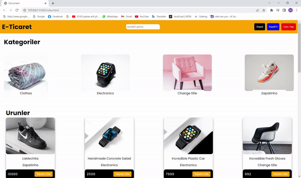

# E-Commerce Website

This project is a web-based e-commerce platform built using HTML, CSS, and JavaScript. It allows users to browse products, add them to their cart, and checkout using a simple and intuitive interface.

## Features

<ul>
 <li>Browse products by category or search by keyword</li>
 <li>Add products to cart and update quantity</li>
 <li>Remove products from cart</li>
 <li>Checkout using a secure payment gateway</li>
 <li>View order history</li>
</ul>

## Installation

1. Clone the repository from GitHub:
 
 git clone https://github.com/mhmtkarakas/E-COMMERCE--with-JAVASCRIPT-API.git

2. Open the project folder and launch index.html in your browser.

## Screen Gif

